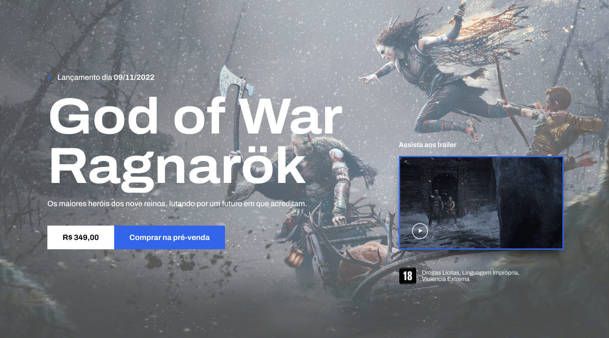

# Projeto God of War: Ragnarök

Este é um projeto de projeto para o jogo "God of War: Ragnarök", desenvolvido utilizando HTML5, SASS, CSS e JavaScript. Foi criado como parte do meu portfólio pessoal e destina-se a demonstrar minhas habilidades de desenvolvimento web.

## Visão Geral

O objetivo deste projeto é criar um projeto envolvente que forneça informações sobre o jogo, trailers, imagens e uma experiência imersiva para os fãs. Queremos compartilhar nossa empolgação pelo próximo lançamento e oferecer aos visitantes uma visão exclusiva do mundo de "God of War: Ragnarök".

## Capturas de Tela

Aqui estão algumas capturas de tela do projeto:

## Recursos

O projeto contém os seguintes recursos:

- **Página Inicial**: Apresentação do jogo e teaser.

- **Trailer**: Reprodução do trailer oficial do jogo.

- **Personagens**: Listagem dos personagens de "God of War: Ragnarök".

- **Notícias**: Últimas notícias e atualizações relacionadas ao jogo.

## Tecnologias Utilizadas

- HTML5
- SASS
- CSS
- JavaScript

## Como Contribuir

Este projeto faz parte do meu portfólio pessoal e, portanto, não está aberto para contribuições externas. No entanto, fique à vontade para explorar o código-fonte e as estruturas utilizadas como referência.

## Autor

Este projeto foi desenvolvido por Arthur César como parte do seu portfólio pessoal.

Espero que este projeto demonstre minhas habilidades de desenvolvimento web e contribua para o meu portfólio pessoal. Aproveite a visita!
